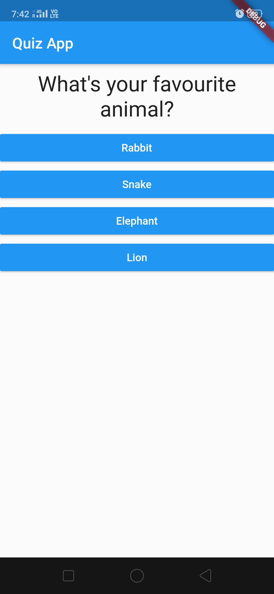
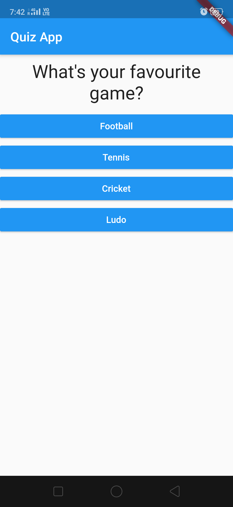

# Personality-Quiz-App
It is a quiz app which at the end of the quiz results in a type of "Personality" according to the answers given by the user. It is a basic app built in Flutter.
# Screenshots :

### Answer I chose was "White" 

< img src = "Screenshot/Screenshot_2020-01-21-19-42-29-22_a77d241ee042ba7782407cbaba94327c.png" width=380 height=760 >

### Answer I chose was "Elephant"

### Answer I chose was "Cricket"

### I now get a personality result as per the answers I chose

